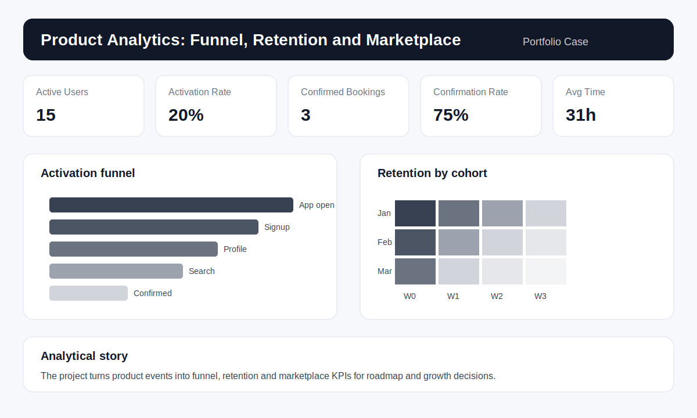

# Product Analytics: Funnel, Retention and Marketplace Metrics

Portfolio project for Product Analytics in a digital marketplace. The goal is to simulate event data, define a tracking plan, measure activation funnel, cohort retention and marketplace efficiency.

The dataset is synthetic and created only for portfolio purposes. It simulates a real product analytics scenario using SQL, DuckDB, Python, event taxonomy, product KPIs and business recommendations.

## Business problem

A digital product needs to understand if users reach the main value moment, where they abandon the journey and whether they return after the first experience. Because it is a marketplace, the team also needs to monitor how well supply and demand connect.

Main questions:

- What share of users completes the activation funnel?
- Which funnel step has the highest user loss?
- Do activated users retain better than non-activated users?
- How long does it take for an opportunity to become confirmed?
- Which acquisition channel brings users with better activation and retention?

## Project goal

Build an analytical layer for product decisions, translating events into actionable indicators for roadmap, growth and user experience improvements.

## Skills demonstrated

- Tracking plan and event taxonomy.
- SQL for funnel analysis, cohorts, segmentation and marketplace metrics.
- Python for synthetic data generation.
- DuckDB as a local analytical engine.
- Documentation for events, properties, business rules and data quality.
- Data storytelling for product prioritization.

## Repository structure

```text
product-analytics-funnel-retention/
├── data/
│   ├── sample_users.csv
│   ├── sample_events.csv
│   ├── sample_marketplace_actions.csv
│   └── README.md
├── docs/
│   ├── business_rules.md
│   ├── dashboard_blueprint.md
│   ├── data_dictionary.md
│   └── tracking_plan.md
├── images/
│   └── dashboard_preview.svg
├── powerbi/
│   └── measures_dax.md
├── scripts/
│   ├── generate_product_events.py
│   └── run_sql.py
├── sql/
│   ├── 01_create_schema_duckdb.sql
│   ├── 02_data_quality_checks.sql
│   ├── 03_funnel_analysis.sql
│   ├── 04_retention_cohorts.sql
│   └── 05_marketplace_metrics.sql
├── requirements.txt
└── README.md
```

## Activation funnel

1. `app_open`
2. `signup_completed`
3. `profile_completed`
4. `search_performed`
5. `opportunity_viewed`
6. `invitation_sent`
7. `booking_confirmed`

The event `booking_confirmed` represents the main value moment.

## Main KPIs

- Active users
- New users
- Funnel conversion by step
- Funnel loss by step
- Time to activation
- D1, D7 and D30 retention
- Monthly cohort retention
- Invitation sent rate
- Confirmation rate
- Time to confirmation
- Marketplace liquidity

## Dashboard preview



## How to run locally

1. Clone the repository:

```bash
git clone https://github.com/bruniversamente/product-analytics-funnel-retention.git
cd product-analytics-funnel-retention
```

2. Install dependencies:

```bash
pip install -r requirements.txt
```

3. Run the SQL scripts with DuckDB:

```bash
python scripts/run_sql.py
```

4. Generate a larger dataset if needed:

```bash
python scripts/generate_product_events.py
```

## Expected insights

This analysis helps identify:

1. Onboarding steps with the highest user loss.
2. Acquisition channels with better activation quality.
3. Retention differences between activated and non-activated users.
4. Marketplace liquidity gaps.
5. Changes in average time to confirmation.

## Simulated business recommendations

- Reduce friction between signup and profile completion.
- Trigger reminders for users who viewed opportunities but did not send invitations.
- Prioritize categories with high search volume and low confirmation rate.
- Monitor retention among users who reached the value moment.
- Create alerts when time to confirmation exceeds the expected threshold.

## Next steps

- Build the final Power BI `.pbix` file.
- Add a simulated A/B experiment analysis.
- Add segmentation by persona, channel and opportunity category.
- Publish the case in the main portfolio website.

## Author

Bruno Nascimento  
[LinkedIn](https://linkedin.com/in/bruniversamente) | [GitHub](https://github.com/bruniversamente)
