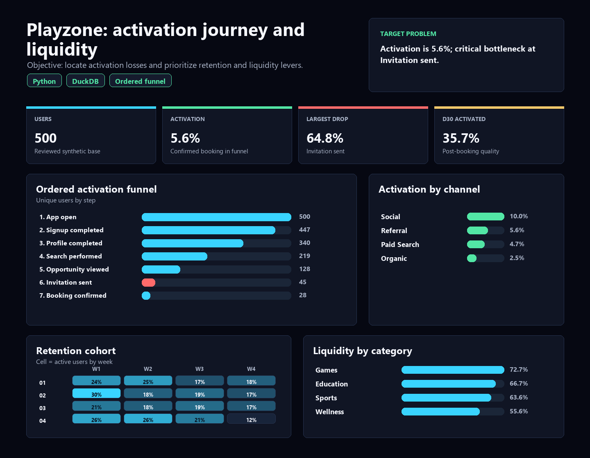

# Playzone Product Analytics: activation, retention and marketplace liquidity

[Portuguese version](README.pt-BR.md)

Product analytics case study designed to answer a product question: **where should Playzone act first to increase activation?**

Playzone simulates a digital platform for experiences, games and activities. The case measures whether users reach the product's value moment, where the journey loses momentum, which acquisition channels activate better, whether activation connects with retention, and which marketplace categories create more liquidity.

> Synthetic data created for demonstration purposes. The project simulates a real product analytics workflow with Python, SQL, DuckDB, tracking plan, data quality checks, ordered funnel metrics, retention cohorts and a reproducible HTML dashboard.

## Executive Summary

**Core question:** are Playzone users reaching the value moment: a confirmed booking after discovering an opportunity and sending an invitation?

**Short answer:** only a small share of users reaches activation. The biggest opportunity is not bringing more users to the top of the funnel; it is reducing the drop between **Opportunity viewed** and **Invitation sent**.

**Recommended decision:** before increasing acquisition spend, Playzone should improve the invitation step: opportunity recommendations, value proposition clarity, availability, invite incentives, social proof or friction in the screen where users decide to move forward.

Current build highlights:

| Metric | Result |
|---|---:|
| Users analyzed | 500 |
| Events analyzed | 2,316 |
| Opportunities created | 219 |
| Ordered activation rate | 5.6% |
| Confirmed bookings | 28 |
| Confirmation rate after invitation | 62.2% |
| Largest funnel drop | Invitation sent, 64.8% loss from previous step |
| Best channel by ordered activation | Social, 10.0% |
| Weakest channel by ordered activation | Organic, 2.5% |
| Strongest category after invitation | Games, 72.7% confirmation |
| Critical data quality failures | 0 |

## What The Analysis Demonstrates

The project connects a product question to a measurable decision:

1. **Clear business problem:** increase activation in a digital product.
2. **Well-defined metric:** confirmed booking in an ordered funnel, not just clicks or signups.
3. **Actionable diagnosis:** the largest leak is before the invitation, not at the top of the funnel.
4. **Auditable delivery:** synthetic data, SQL, CSV outputs, documentation and a reproducible dashboard.

## Dashboard

Open the static dashboard at:

```text
dashboard/playzone_product_analytics_dashboard.html
```

Explicit language variants are also generated:

```text
dashboard/playzone_product_analytics_dashboard_en.html
dashboard/playzone_product_analytics_dashboard_pt-BR.html
```

It is designed for product and analytics readers: top KPIs, ordered funnel, channel comparison, retention by activation, category liquidity and weekly cohorts.



## Business Problem

Playzone needs to know whether the product is leading users to the value moment. Signup or app open is not enough: the strongest signal is a confirmed booking, because it means the platform connected interest, opportunity and availability.

Questions answered:

- What share of users reaches confirmed booking?
- Which funnel step loses the most users?
- Do activated users retain better than non-activated users?
- Which channels bring higher-activation users?
- Which categories have better liquidity after invitation?
- Are the data consistent enough to support the read?

## Product Read

The ordered funnel shows the journey does not break at a single technical event; it loses momentum progressively. The most critical point is the move from **Opportunity viewed** to **Invitation sent**: 128 users view an opportunity, but only 45 send an invitation. That is a **64.8%** loss at this step.

After an invitation is sent, the confirmation rate is **62.2%**. This suggests the main issue is not necessarily the final confirmation step, but the previous decision: turning user interest into action.

The channel read reinforces the need to investigate acquisition quality and product promise. **Social** reaches **10.0%** ordered activation, while **Organic** reaches **2.5%**. This is not causal proof, but it is a strong starting point for investigating messaging, user intent and onboarding.

Retention also supports activation as a key metric: activated users reach **35.7% D30 retention**, compared with **14.8%** among non-activated users.

## Analytical Methodology

The main funnel is calculated in chronological order by user:

1. `app_open`
2. `signup_completed`
3. `profile_completed`
4. `search_performed`
5. `opportunity_viewed`
6. `invitation_sent`
7. `booking_confirmed`

This avoids a common mistake: counting users who had the events, but not necessarily in the correct sequence. D1, D7 and D30 retention are measured through return app opens after signup, so initial journey events are not counted as retention.

## Deliverables

- `dashboard/playzone_product_analytics_dashboard.html`: default English dashboard.
- `dashboard/playzone_product_analytics_dashboard_en.html`: explicit English dashboard.
- `dashboard/playzone_product_analytics_dashboard_pt-BR.html`: Portuguese dashboard.
- `outputs/executive_findings.md`: English executive findings.
- `outputs/executive_findings.pt-BR.md`: Portuguese executive findings.
- `outputs/*.csv`: reviewed analytical extracts.
- `docs/`: business rules, tracking plan, data dictionary and dashboard blueprint.
- `scripts/`: synthetic data generation, output build and SQL runner.
- `sql/`: DuckDB queries for quality checks, funnel, retention and marketplace metrics.

## Skills Demonstrated

- Product analytics: activation funnel, cohorts, retention and marketplace liquidity.
- SQL: CTEs, windows, joins, ordered funnel logic and segmented metrics.
- Python: synthetic data generation and reproducible output build.
- DuckDB: local analytical modeling and reviewable queries.
- Data quality: event taxonomy, duplicate IDs, missing users, invalid dates and temporal order checks.
- Storytelling: translating metrics into product recommendations.
- Visualization: portable HTML dashboard without external runtime dependencies.

## Reproduce

```bash
pip install -r requirements.txt
python scripts/build_outputs.py
python scripts/run_sql.py
```

Open:

```text
dashboard/playzone_product_analytics_dashboard.html
```

## Simulated Recommendations

1. Prioritize the drop from opportunity viewed to invitation sent, because it is the largest measurable funnel leak.
2. Review the invitation flow: value proposition clarity, availability, price, social proof, reminders and calls to action.
3. Investigate why `Organic` activates less than `Social`, treating channel as a hypothesis about intent and acquisition quality.
4. Use activated users as the retention benchmark, because the D30 difference is meaningful.
5. Improve offer, availability or recommendations in categories with lower confirmation rates.
6. Keep data quality checks in place before publishing product metrics to leadership.

## Method References

- [Amplitude: Funnel Analysis](https://amplitude.com/docs/analytics/charts/funnel-analysis/funnel-analysis-build)
- [Amplitude: ordered funnel computation](https://amplitude.com/docs/analytics/charts/funnel-analysis/funnel-analysis-how-amplitude-computes)
- [Mixpanel: Retention reports](https://docs.mixpanel.com/docs/reports/retention)
- [PostHog: Funnels](https://posthog.com/docs/product-analytics/funnels)

## Author

Bruno Nascimento  
[LinkedIn](https://linkedin.com/in/bruniversamente) | [GitHub](https://github.com/bruniversamente)
