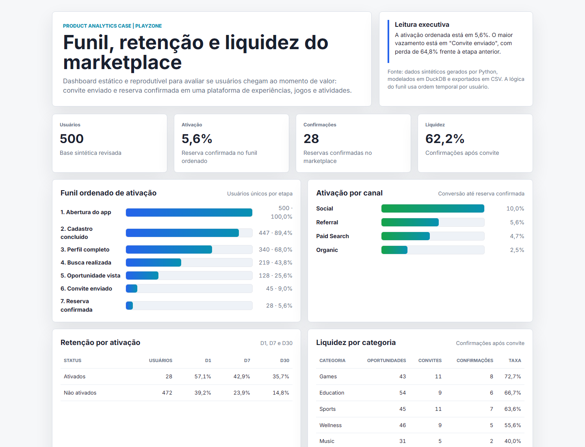

# Playzone Product Analytics: ativação, retenção e liquidez

[English version](README.md)

Estudo de caso de Product Analytics desenhado para responder uma pergunta de produto: **onde a Playzone deve atuar primeiro para aumentar a ativação?**

A Playzone simula uma plataforma digital de experiências, jogos e atividades. O case mede se usuários chegam ao momento de valor, onde a jornada perde força, quais canais ativam melhor, se ativação se conecta com retenção e quais categorias geram mais liquidez no marketplace.

> Dados sintéticos criados para demonstração. O projeto simula um cenário real de produto digital usando Python, SQL, DuckDB, tracking plan, validações de dados, métricas de funil, cohorts de retenção e um dashboard HTML reprodutível.

## Resumo executivo

**Pergunta central:** usuários da Playzone chegam ao momento de valor, ou seja, uma reserva confirmada depois de descobrir uma oportunidade e enviar convite?

**Resposta curta:** poucos usuários chegam até a ativação. A maior oportunidade não está em trazer mais usuários para o topo do funil, e sim em reduzir a perda entre **Oportunidade vista** e **Convite enviado**.

**Decisão recomendada:** antes de aumentar investimento em aquisição, a Playzone deveria priorizar o passo de envio de convite: melhorar recomendação de oportunidades, clareza da proposta, disponibilidade, incentivo ao convite ou fricções da tela onde o usuário decide avançar.

Principais achados gerados pelo build atual:

- Usuários analisados: **500**
- Eventos analisados: **2.316**
- Oportunidades criadas: **219**
- Taxa de ativação ordenada: **5,6%**
- Reservas confirmadas: **28**
- Taxa de confirmação depois do convite: **62,2%**
- Maior perda do funil: **Convite enviado**, com **64,8%** de perda frente a etapa anterior
- Melhor canal por ativação ordenada: **Social**, com **10,0%**
- Canal mais fraco por ativação ordenada: **Organic**, com **2,5%**
- Categoria mais forte depois do convite: **Games**, com **72,7%** de confirmação
- Falhas críticas de qualidade de dados: **0**

## O que a análise demonstra

O projeto conecta uma pergunta de produto a uma decisão mensurável:

1. **Problema de negócio claro:** aumentar ativação em um produto digital.
2. **Métrica bem definida:** reserva confirmada no funil ordenado, não apenas clique ou cadastro.
3. **Diagnóstico acionável:** o maior vazamento está antes do convite, não no topo do funil.
4. **Entrega auditável:** dados sintéticos, SQL, outputs CSV, documentação e dashboard reproduzível.

## Dashboard

Abra o dashboard publicado: [Playzone Product Analytics](https://bruniversamente.github.io/dashboards/?case=playzone&lang=pt).

Arquivo HTML local reproduzível: [playzone_product_analytics_dashboard_pt-BR.html](dashboard/playzone_product_analytics_dashboard_pt-BR.html).

Ele foi pensado para leitura executiva e técnica: cards no topo, funil ordenado, comparação por canal, retenção por ativação, liquidez por categoria e cohorts semanais.



## Problema de negócio

A Playzone precisa saber se o produto está levando usuários ao momento de valor. Não basta medir cadastro ou abertura do app: o sinal mais importante é a reserva confirmada, porque ela indica que a plataforma conseguiu conectar interesse, oportunidade e disponibilidade.

Perguntas respondidas:

- Qual percentual de usuários chega até a reserva confirmada?
- Em qual etapa o funil perde mais usuários?
- Usuários ativados retêm melhor que usuários não ativados?
- Quais canais trazem usuários com maior ativação?
- Quais categorias têm melhor liquidez depois do convite?
- Os dados estão consistentes o suficiente para sustentar a leitura?

## Leitura de produto

O funil mostra que a jornada não quebra em um único evento técnico; ela perde força progressivamente. O ponto mais crítico é a passagem de **Oportunidade vista** para **Convite enviado**: 128 usuários chegam a visualizar uma oportunidade, mas apenas 45 enviam convite. Isso representa uma perda de **64,8%** nessa etapa.

Depois que o convite é enviado, a taxa de confirmação é de **62,2%**. Isso sugere que o problema principal não é necessariamente a etapa final de confirmação, mas a decisão anterior: fazer o usuário transformar interesse em ação.

A leitura de canal reforça a necessidade de investigar qualidade de aquisição e promessa de produto. O canal **Social** chega a **10,0%** de ativação ordenada, enquanto **Organic** fica em **2,5%**. Essa diferença não deve ser lida como prova causal, mas como um bom ponto de partida para investigar mensagem, intenção do usuário e onboarding.

Na retenção, usuários ativados também performam melhor: D30 de **35,7%** contra **14,8%** entre não ativados. Isso torna a ativação uma métrica ainda mais importante, porque ela parece separar usuários com maior chance de voltar ao produto.

## Metodologia analítica

O funil principal é calculado em ordem temporal por usuário:

1. `app_open`
2. `signup_completed`
3. `profile_completed`
4. `search_performed`
5. `opportunity_viewed`
6. `invitation_sent`
7. `booking_confirmed`

Essa abordagem evita um erro comum: contar usuários que tiveram os eventos, mas não necessariamente na sequência correta. A lógica se aproxima da forma como ferramentas de produto tratam funis ordenados.

Retenção D1, D7 e D30 foi medida com retorno ao app (`app_open`) nos dias 1, 7 e 30 após cadastro. Isso evita contar eventos da própria jornada inicial como se fossem retenção.

## Entregáveis

- `outputs/executive_findings.md`: resumo executivo em inglês.
- `outputs/executive_findings.pt-BR.md`: resumo executivo em português.

```text
product-analytics-funnel-retention/
├── dashboard/
│   ├── playzone_product_analytics_dashboard.html
│   ├── playzone_product_analytics_dashboard_en.html
│   └── playzone_product_analytics_dashboard_pt-BR.html
├── data/
│   ├── sample_users.csv
│   ├── sample_events.csv
│   ├── sample_marketplace_actions.csv
│   └── generated/
│       ├── users.csv
│       ├── events.csv
│       └── marketplace_actions.csv
├── docs/
│   ├── business_rules.md
│   ├── dashboard_blueprint.md
│   ├── data_dictionary.md
│   └── tracking_plan.md
├── outputs/
│   ├── executive_findings.md
│   ├── executive_findings.pt-BR.md
│   ├── kpi_summary.csv
│   ├── ordered_funnel.csv
│   ├── funnel_by_channel.csv
│   ├── retention_by_activation.csv
│   ├── cohort_retention.csv
│   ├── marketplace_category_metrics.csv
│   ├── data_quality_summary.csv
│   └── dashboard_data.json
├── scripts/
│   ├── generate_product_events.py
│   ├── build_outputs.py
│   └── run_sql.py
├── sql/
│   ├── 01_create_schema_duckdb.sql
│   ├── 02_data_quality_checks.sql
│   ├── 03_funnel_analysis.sql
│   ├── 04_retention_cohorts.sql
│   └── 05_marketplace_metrics.sql
└── README.md
```

## Competências demonstradas

- Product Analytics: funil de ativação, cohorts, retenção e liquidez de marketplace.
- SQL: CTEs, janelas, joins, funil ordenado e métricas segmentadas.
- Python: geração de dados sintéticos e build reprodutível de outputs.
- DuckDB: modelagem analítica local e consultas revisáveis.
- Data Quality: checagens de taxonomia, IDs duplicados, usuário inexistente, data inválida e ordem temporal.
- Storytelling: tradução de métricas em recomendações de produto.
- Visualização: dashboard HTML portátil, sem dependência externa para abrir.

## Como reproduzir

1. Instale dependências:

```bash
pip install -r requirements.txt
```

2. Gere os dados, outputs e dashboard:

```bash
python scripts/build_outputs.py
```

3. Rode os SQLs principais com DuckDB:

```bash
python scripts/run_sql.py
```

4. Abra o dashboard local: [playzone_product_analytics_dashboard_pt-BR.html](dashboard/playzone_product_analytics_dashboard_pt-BR.html).

## Recomendações simuladas

1. Priorizar a passagem de oportunidade vista para convite enviado, porque é o maior vazamento mensurável do funil.
2. Revisar a tela ou fluxo de convite: clareza da proposta, disponibilidade, preço, prova social, lembretes e chamadas para ação.
3. Investigar por que `Organic` ativa menos que `Social`, tratando canal como hipótese de intenção e qualidade de aquisição.
4. Usar usuários ativados como benchmark de retenção, já que a diferença em D30 é relevante.
5. Reforçar oferta, disponibilidade ou recomendação nas categorias com menor taxa de confirmação.
6. Manter checagens de qualidade antes de publicar métricas de produto.

## Referências de metodologia

- [Amplitude: Funnel Analysis](https://amplitude.com/docs/analytics/charts/funnel-analysis/funnel-analysis-build)
- [Amplitude: ordered funnel computation](https://amplitude.com/docs/analytics/charts/funnel-analysis/funnel-analysis-how-amplitude-computes)
- [Mixpanel: Retention reports](https://docs.mixpanel.com/docs/reports/retention)
- [PostHog: Funnels](https://posthog.com/docs/product-analytics/funnels)

## Autor

Bruno Nascimento  
[LinkedIn](https://linkedin.com/in/bruniversamente) | [GitHub](https://github.com/bruniversamente)
